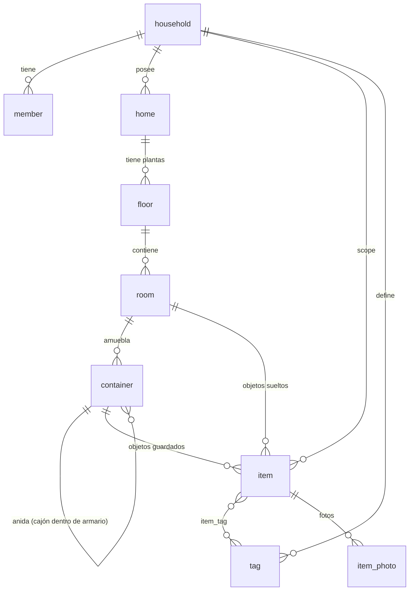

# HomeHoard — Spec Técnico: Modelo de Datos, Plano 2D y UI

*Miembro de la familia Hoard (WatchHoard, GamerHoard, BookHoard…), pero con un giro: **local-first, sin nada online por ahora**. Reusa el stack Hoard "muy relativamente" — la misma base de Expo/SQLite, sin Supabase, sin API, sin capa social.*

**Fecha:** 15 de julio de 2026
**Estado:** Spec inicial para arrancar el MVP.

---

## 1. Qué es HomeHoard

Un inventario de casa **rápido y visual**. Mapeas tu vivienda (plantas, habitaciones, muebles), metes tus cosas de forma simple, y luego encuentras cualquier objeto en segundos: *"¿dónde está el pasaporte?"*, *"¿qué hay en el armario del dormitorio?"*, *"enséñame todo lo etiquetado como «invierno»"*.

**La apuesta de producto:** el valor no es hacer una base de datos bonita, es que **añadir y encontrar** sea tan rápido que de verdad lo uses. Todo lo demás está al servicio de esas dos acciones.

### Objetivos (MVP)
- **Mapear la casa** como un plano visual 2D: plantas → habitaciones → muebles.
- **Alta rápida** de objetos (idealmente < 10 s por objeto): nombre, foto opcional, ubicación, tags.
- **Búsqueda instantánea** por nombre y por tags, con la ruta completa del objeto ("Piso › Planta baja › Dormitorio › Armario › Cajón superior").
- **Vistas de contenido**: ver todo lo que hay en una habitación o en un mueble (incluyendo lo anidado).
- **100% offline**, en el móvil y en web, con los mismos datos y el mismo código.

### No-objetivos (por ahora)
- Sin cuentas, login, ni servidor. Sin API. Sin feed social.
- Sin sincronización en la nube todavía — **pero el modelo se diseña para admitirla sin reescribirse** (§9).
- Sin escaneo de códigos de barras / OCR / IA de reconocimiento en el MVP (candidatos a v1.x).

### El futuro online (contexto que condiciona hoy)
Lo online llegará como **funciones premium**: (1) **backup en la nube con suscripción** y (2) **miembros de la familia** compartiendo el mismo inventario. Esto no se construye ahora, pero fija dos decisiones de arquitectura que sí tomamos hoy: **IDs tipo UUID** y **un concepto latente de "hogar" (`household`)** como límite de compartición. Ver §9.

---

## 2. Principios de diseño

1. **Local-first de verdad.** La app funciona entera sin red. La base de datos es la fuente de la verdad y vive en el dispositivo (SQLite).
2. **Preparado para sincronizar, sin pagar el coste hoy.** Cada fila lleva `id` UUID, `created_at`, `updated_at` y `deleted_at` (tombstone). Cuando llegue el backup/familia, sincronizar es "diffear timestamps", no rehacer el esquema.
3. **Rápido a capturar.** Un botón flotante de "＋" siempre visible; el formulario de alta recuerda la última ubicación y permite "guardar y añadir otro". La ubicación se autoselecciona por el contexto (si estás dentro de un mueble y pulsas ＋, ya viene rellenada).
4. **Un solo código, dos plataformas.** React Native + `react-native-web`, exactamente como WatchHoard. El plano 2D se dibuja con SVG, que se renderiza idéntico en móvil y navegador.
5. **El modelo espacial y el jerárquico son lo mismo.** Los datos son una jerarquía (hogar › planta › habitación › mueble › objeto). El "plano 2D" es solo una *vista* con coordenadas encima de esa jerarquía. Puedes usar la app sin dibujar ningún plano — la geometría es opcional.

---

## 3. Stack técnico

Partimos del stack Hoard y le quitamos toda la mitad online.

| Capa | Elección | Notas |
|---|---|---|
| Framework | **Expo ~52 / React Native 0.76** | Igual que WatchHoard/GamerHoard. |
| Navegación | **expo-router** (file-based, tabs) | Reuso directo del patrón `app/(tabs)`. |
| Web | **react-native-web** | Mismo código; "móvil para capturar, web para gestionar". |
| Base de datos | **expo-sqlite** (SQLite local) | Ya está en la plantilla. Fuente de la verdad. |
| Acceso a datos | **Drizzle ORM** + drizzle-kit *(recomendado)* | Consultas y migraciones tipadas sobre expo-sqlite. Opcional: SQL a mano. |
| Listas | **@shopify/flash-list** | Listas largas de objetos sin jank. |
| Estado servidor/consultas | **@tanstack/react-query** | Aquí envuelve consultas locales async (no red). |
| **Plano 2D** | **react-native-svg** | Render vectorial idéntico en móvil y web. Pieza nueva clave. |
| **Gestos/zoom** | **react-native-gesture-handler** + **react-native-reanimated** | Pan/zoom del plano y drag de muebles. gesture-handler ya está. |
| Fotos | **expo-image-picker** + **expo-file-system** | Capturar/elegir foto y guardarla en el sandbox de la app. |
| Imágenes | **expo-image** | Ya está. Miniaturas rápidas con caché. |
| UUIDs | **expo-crypto** (`randomUUID()`) | IDs generados en cliente (clave para el sync futuro). |
| i18n | **i18next / react-i18next** *(opcional)* | Reuso de WatchHoard; ES por defecto. |

**Se elimina de la plantilla:** `@supabase/supabase-js`, la carpeta `auth/`, el paquete `importer`, moderación, feed, y todo lo `*-prod-*`. HomeHoard **no** tiene `packages/core` compartido con backend ni `supabase/`.

**Estructura propuesta** (monorepo ligero, o incluso una sola app):
```
homehoard/
  apps/mobile/            # la app Expo (móvil + web)
    app/                  # rutas expo-router
    src/db/               # esquema drizzle, migraciones, seed
    src/plan/             # render y edición del plano 2D (SVG)
    src/features/         # alta rápida, búsqueda, item, room…
    assets/
  packages/               # (opcional) tipos compartidos si algún día hay backend
```

---

## 4. Modelo de datos

### 4.1 Diagrama de relaciones



**Ideas clave del modelo:**
- **Jerarquía espacial con geometría:** `home › floor › room`. Son los niveles del *plano*. Cada `floor` es un lienzo (en cm); cada `room` es un rectángulo/polígono dentro de él.
- **Contenedores = árbol.** Un `container` es cualquier sitio donde guardas cosas (armario, cómoda, estantería, caja, cajón, nevera…). Se **anida** con `parent_container_id` (un cajón dentro de un armario). Los contenedores raíz (sin padre) se colocan en el plano de su habitación con coordenadas; los anidados no necesitan geometría (se navegan como lista).
- **Objetos con ubicación desnormalizada.** Cada `item` guarda **siempre** `room_id`, y opcionalmente `container_id` (NULL = suelto en la habitación). Desnormalizar `room_id` hace que *"todo lo de esta habitación"* sea una consulta trivial sin recursión, incluso para objetos enterrados en un cajón dentro de un mueble.
- **Todo lo sincronizable** lleva `id` (UUID texto), `created_at`, `updated_at`, `deleted_at`.

### 4.2 DDL (SQLite) — *validado ejecutándolo*

```sql
PRAGMA foreign_keys = ON;
-- Convención: id = UUID texto; *_at = epoch en milisegundos; deleted_at NULL = fila viva (tombstone).

-- ── Núcleo de compartición (multiusuario futuro) ──────────────
CREATE TABLE household (               -- el "hogar": límite de compartición para la familia
  id TEXT PRIMARY KEY, name TEXT NOT NULL,
  created_at INTEGER NOT NULL, updated_at INTEGER NOT NULL, deleted_at INTEGER
);
CREATE TABLE member (                  -- miembros del hogar (hoy: 1 implícito)
  id TEXT PRIMARY KEY, household_id TEXT NOT NULL REFERENCES household(id),
  name TEXT NOT NULL, role TEXT NOT NULL DEFAULT 'owner',   -- owner | editor | viewer
  created_at INTEGER NOT NULL, updated_at INTEGER NOT NULL, deleted_at INTEGER
);

-- ── Jerarquía espacial (el "mapa") ────────────────────────────
CREATE TABLE home (                    -- una vivienda (casa, piso, trastero, oficina…)
  id TEXT PRIMARY KEY, household_id TEXT NOT NULL REFERENCES household(id),
  name TEXT NOT NULL, kind TEXT NOT NULL DEFAULT 'house',
  created_at INTEGER NOT NULL, updated_at INTEGER NOT NULL, deleted_at INTEGER
);
CREATE TABLE floor (                   -- planta/nivel = lienzo del plano (dimensiones reales en cm)
  id TEXT PRIMARY KEY, home_id TEXT NOT NULL REFERENCES home(id),
  name TEXT NOT NULL, level_index INTEGER NOT NULL DEFAULT 0,
  width_cm INTEGER NOT NULL DEFAULT 1000, height_cm INTEGER NOT NULL DEFAULT 1000,
  created_at INTEGER NOT NULL, updated_at INTEGER NOT NULL, deleted_at INTEGER
);
CREATE TABLE room (                    -- habitación = polígono/rectángulo en el plano del floor
  id TEXT PRIMARY KEY, floor_id TEXT NOT NULL REFERENCES floor(id),
  name TEXT NOT NULL, kind TEXT, color TEXT,
  shape TEXT NOT NULL DEFAULT 'rect',  -- rect | polygon
  x_cm REAL NOT NULL DEFAULT 0, y_cm REAL NOT NULL DEFAULT 0,   -- esquina sup-izq (rect)
  width_cm REAL NOT NULL DEFAULT 300, height_cm REAL NOT NULL DEFAULT 300,
  rotation REAL NOT NULL DEFAULT 0,    -- grados
  points_json TEXT,                    -- [[x,y],…] si shape='polygon'
  created_at INTEGER NOT NULL, updated_at INTEGER NOT NULL, deleted_at INTEGER
);

-- ── Contenedores / muebles (árbol) ────────────────────────────
CREATE TABLE container (
  id TEXT PRIMARY KEY, room_id TEXT NOT NULL REFERENCES room(id),
  parent_container_id TEXT REFERENCES container(id),   -- NULL = mueble raíz en la habitación
  name TEXT NOT NULL, kind TEXT, icon TEXT,             -- wardrobe|dresser|shelf|box|drawer|fridge…
  x_cm REAL, y_cm REAL, width_cm REAL, height_cm REAL,  -- coords RELATIVAS a la habitación (solo raíz)
  rotation REAL NOT NULL DEFAULT 0,
  created_at INTEGER NOT NULL, updated_at INTEGER NOT NULL, deleted_at INTEGER
);

-- ── Objetos ───────────────────────────────────────────────────
CREATE TABLE item (
  id TEXT PRIMARY KEY, household_id TEXT NOT NULL REFERENCES household(id),
  name TEXT NOT NULL, description TEXT, quantity INTEGER NOT NULL DEFAULT 1,
  room_id TEXT NOT NULL REFERENCES room(id),           -- SIEMPRE presente (desnormalizado)
  container_id TEXT REFERENCES container(id),           -- NULL = suelto en la habitación
  photo_uri TEXT,                                       -- foto principal (file://… local)
  created_at INTEGER NOT NULL, updated_at INTEGER NOT NULL, deleted_at INTEGER
);
CREATE TABLE item_photo (              -- fotos adicionales (opcional)
  id TEXT PRIMARY KEY, item_id TEXT NOT NULL REFERENCES item(id),
  uri TEXT NOT NULL, position INTEGER NOT NULL DEFAULT 0, created_at INTEGER NOT NULL
);

-- ── Tags ──────────────────────────────────────────────────────
CREATE TABLE tag (
  id TEXT PRIMARY KEY, household_id TEXT NOT NULL REFERENCES household(id),
  name TEXT NOT NULL, color TEXT,
  created_at INTEGER NOT NULL, updated_at INTEGER NOT NULL, deleted_at INTEGER
);
CREATE TABLE item_tag (
  item_id TEXT NOT NULL REFERENCES item(id), tag_id TEXT NOT NULL REFERENCES tag(id),
  PRIMARY KEY (item_id, tag_id)
);

-- ── Búsqueda de texto completa (FTS5) ─────────────────────────
CREATE VIRTUAL TABLE item_fts USING fts5(name, description, tags, content='');

-- ── Índices ───────────────────────────────────────────────────
CREATE INDEX idx_item_room       ON item(room_id);
CREATE INDEX idx_item_container  ON item(container_id);
CREATE INDEX idx_container_room  ON container(room_id);
CREATE INDEX idx_container_parent ON container(parent_container_id);
CREATE INDEX idx_room_floor      ON room(floor_id);
CREATE INDEX idx_floor_home      ON floor(home_id);
```

### 4.3 Diccionario rápido de entidades

| Entidad | Es… | Geometría en plano | Notas |
|---|---|---|---|
| `household` | El hogar (unidad de compartición) | — | Hoy 1, creado al primer arranque. Futuro: familia. |
| `member` | Persona del hogar | — | Hoy 1 (owner). Futuro: invitar familia con rol. |
| `home` | Una vivienda | — | Puedes tener varias (casa + trastero). |
| `floor` | Planta / nivel | **Lienzo** (width×height cm) | El fondo del plano 2D. |
| `room` | Habitación | **Rect o polígono** | Se dibuja sobre el floor. |
| `container` | Mueble / almacenamiento | Rect **relativo a la habitación** (solo raíz) | Árbol anidable. Cajón, caja, balda… |
| `item` | Objeto | — | `room_id` siempre; `container_id` opcional. |
| `tag` | Etiqueta | — | Transversal: "invierno", "importante", "frágil". |

---

## 5. El plano visual 2D

Es la característica que diferencia HomeHoard. Diseño pensado para que sea **vistoso pero acotado**: rectángulos con etiquetas y iconos, no un CAD.

### 5.1 Sistema de coordenadas
- **Unidades reales: centímetros.** El `floor` define un lienzo, p. ej. 900 × 700 cm. Las habitaciones y muebles se posicionan en ese espacio con medidas reales → el plano es proporcional a la casa de verdad y los muebles tienen tamaños creíbles.
- **Jerarquía de coordenadas:** `room` en coordenadas absolutas del floor; `container` raíz en coordenadas **relativas a su habitación** (al renderizar: `room.x + container.x`). Así, si mueves una habitación, sus muebles la acompañan.
- **Independiente de resolución:** se dibuja un `<Svg viewBox="0 0 width_cm height_cm">`. El SVG escala solo a cualquier pantalla → idéntico en móvil y web.

### 5.2 Render (react-native-svg)
- `floor` → fondo del lienzo (rejilla opcional cada 50 cm).
- `room` → `<Rect>` (o `<Polygon points=…>` si `shape='polygon'`) con `color` de relleno translúcido y su nombre centrado.
- `container` raíz → `<Rect>` más pequeño encima de su habitación, con icono según `kind` y etiqueta.
- Una capa de transform (pan/zoom) envuelve todo el contenido.

### 5.3 Gestos e interacción
- **Modo ver (por defecto):**
  - *Pan*: arrastrar con un dedo (o arrastrar con ratón en web).
  - *Zoom*: pellizco (o rueda del ratón en web).
  - *Tap en habitación* → abre la habitación.
  - *Tap en mueble* → abre el contenedor.
- **Modo editar** (toggle "✏️ Editar"):
  - Arrastrar para mover; tiradores en las esquinas para redimensionar; tirador superior para rotar.
  - **Snap a rejilla** (p. ej. 10 cm) para que encaje limpio.
  - Tap en lienzo vacío → crea una habitación rectangular por defecto (luego renombras/ajustas).
  - Dentro de una habitación (modo editar), tap → coloca un mueble nuevo.

### 5.4 Navegación de dos niveles ("como un mapa")
1. **Plano de la planta** → muestra las habitaciones (con silueta opcional de los muebles).
2. **Vista de habitación** → mini-plano de esa habitación con sus muebles colocados (tap-through a cada uno) **+** lista de objetos sueltos. Botón para alternar plano ⇄ lista.
3. **Vista de contenedor** (mueble) → lista de sub-contenedores + objetos, con migas de pan de la ruta completa. Aquí ya no hay plano: la profundidad (cajones, cajas) se navega como lista.
4. **Vista de objeto** → foto, nombre, cantidad, tags, ruta ("Piso › Planta baja › Dormitorio › Armario › Cajón"), editar.

> **Nota de build order:** el plano 2D es lo más pesado. Como el modelo de datos ya guarda la jerarquía completa **con o sin geometría**, se puede lanzar primero la navegación por listas (Fase 1) y montar el plano encima (Fase 2) sin tocar los datos. Las columnas de geometría simplemente están vacías hasta la Fase 2. Ver §10.

---

## 6. Consultas clave *(validadas ejecutándolas en SQLite)*

Estas son las operaciones que definen la app. Todas comprobadas contra datos de prueba.

**Ver todo lo de una habitación** (directo, sin recursión, gracias a `room_id` desnormalizado):
```sql
SELECT name, quantity FROM item
WHERE room_id = :room AND deleted_at IS NULL ORDER BY name;
-- Devuelve incluso objetos anidados 2+ niveles dentro de un mueble.
```

**Ver todo lo de un mueble, incluyendo sub-contenedores** (árbol → CTE recursivo):
```sql
WITH RECURSIVE sub(id) AS (
  SELECT id FROM container WHERE id = :container
  UNION ALL
  SELECT c.id FROM container c JOIN sub ON c.parent_container_id = sub.id
)
SELECT i.* FROM item i
WHERE i.container_id IN (SELECT id FROM sub) AND i.deleted_at IS NULL;
```

**Búsqueda instantánea por texto** (FTS5, tolera prefijos):
```sql
SELECT i.* FROM item i
JOIN item_fts f ON f.rowid = i.rowid
WHERE item_fts MATCH :q || '*' AND i.deleted_at IS NULL;   -- p. ej. 'zapat' → "Zapatillas running"
```

**Ruta / migas de pan de un objeto** (subiendo el árbol de contenedores + salto espacial):
```sql
-- Parte espacial (Home › Floor › Room):
SELECT ho.name AS home, fl.name AS floor, rm.name AS room
FROM item i JOIN room rm ON i.room_id=rm.id
JOIN floor fl ON rm.floor_id=fl.id JOIN home ho ON fl.home_id=ho.id
WHERE i.id = :item;
-- Parte contenedores (Armario › Cajón…): CTE recursivo subiendo por parent_container_id.
```

**Filtrar por tag**:
```sql
SELECT i.* FROM item i
JOIN item_tag it ON it.item_id = i.id
JOIN tag t ON t.id = it.tag_id
WHERE t.name = :tag AND i.deleted_at IS NULL;
```

**Stats simpáticas** (p. ej. "¿qué habitación acumula más cosas?"):
```sql
SELECT rm.name, COUNT(i.id) AS n FROM room rm
LEFT JOIN item i ON i.room_id = rm.id AND i.deleted_at IS NULL
GROUP BY rm.id ORDER BY n DESC;
```

**Mantenimiento del índice FTS:** al crear/editar/borrar un `item` (o cambiar sus tags), se actualiza `item_fts` en la misma transacción. Se puede hacer con triggers SQLite o en la capa de datos (Drizzle). La columna `tags` del FTS se rellena concatenando los nombres de los tags del objeto, para que buscar "invierno" encuentre objetos por su etiqueta.

---

## 7. Pantallas y navegación

Barra inferior de 4 pestañas (patrón `app/(tabs)` de expo-router):

**🗺️ Mapa · 🔎 Buscar · ＋ Añadir · ⚙️ Ajustes**

| Pantalla | Ruta | Contenido |
|---|---|---|
| **Mapa** | `app/(tabs)/index.tsx` | Plano 2D de la planta activa; selector de planta/vivienda; toggle ver/editar. Tap-through a habitación → mueble → objeto. |
| **Buscar** | `app/(tabs)/search.tsx` | Barra de búsqueda (FTS) + chips de tags + resultados en FlashList, cada uno con su ruta. |
| **Añadir** | acción/FAB global | Hoja de alta rápida (§8). FAB "＋" visible en Mapa y Buscar también. |
| **Ajustes** | `app/(tabs)/settings.tsx` | Gestionar viviendas/plantas, tags, idioma. Sección "Backup y familia" (bloqueada, "Próximamente"). |
| Habitación | `app/room/[id].tsx` | Mini-plano + objetos sueltos; alternar plano/lista. |
| Contenedor | `app/container/[id].tsx` | Sub-contenedores + objetos; migas de pan. |
| Objeto | `app/item/[id].tsx` | Detalle + editar; foto, tags, cantidad, ruta. |
| Editor de plano | modo dentro de Mapa/Habitación | Colocar/mover/redimensionar habitaciones y muebles. |

Tema oscuro por defecto (como WatchHoard), i18n con ES de base.

---

## 8. Flujo de alta rápida (el corazón de la UX)

El requisito "que añadir objetos sea simple" se materializa aquí. Objetivo: **capturar un objeto en un par de toques**.

**Hoja de "Añadir objeto"** (bottom sheet, se abre desde el FAB ＋ en cualquier pantalla):
1. **Nombre** (autofoco en el teclado nada más abrir).
2. **Foto** opcional: botón cámara/galería (`expo-image-picker`). La imagen se guarda en el sandbox de la app (`expo-file-system`) y se referencia por `file://` en `item.photo_uri`.
3. **Ubicación**: selector jerárquico (Vivienda › Planta › Habitación › Mueble). **Se autoselecciona por contexto:**
   - Si abriste ＋ desde la vista de un mueble → ubicación ya rellenada con ese mueble.
   - Si no, recuerda la **última ubicación usada**.
4. **Tags**: chips de tags existentes + crear al vuelo.
5. **Cantidad** (por defecto 1).
6. Botones: **Guardar** y **Guardar y añadir otro** (mantiene la ubicación y limpia el resto → metes 20 cosas de un cajón del tirón).

Detalles que lo hacen rápido:
- La ubicación por contexto/último-uso evita el paso más tedioso.
- "Guardar y añadir otro" está pensado para vaciar un mueble entero de una sentada.
- Foto y tags son opcionales: un objeto válido puede ser solo nombre + ubicación.
- (v1.x) Candidatos para acelerar aún más: dictado por voz para el nombre, y escaneo de código de barras para autocompletar.

---

## 9. Preparación para lo online (backup + familia) — *futuro, no se construye ahora*

El modelo de hoy ya está listo para que mañana el sync sea un añadido, no una reescritura:

- **IDs UUID en cliente** (`expo-crypto randomUUID()`): dos dispositivos pueden crear filas offline sin colisionar. (Por eso las PK son `TEXT`, no `INTEGER AUTOINCREMENT`.)
- **Timestamps + tombstones** (`created_at`, `updated_at`, `deleted_at`) en todas las tablas sincronizables: habilitan una fusión *last-write-wins* por `updated_at` y la **propagación de borrados** (un borrado es un tombstone, no un `DELETE` físico).
- **`household_id` como límite de compartición**: hoy hay un hogar creado al primer arranque; "añadir familia" será insertar más `member` en el mismo `household` con su `role` (owner/editor/viewer). Nada del esquema cambia.
- **Patrón outbox cuando toque**: se añade una tabla `change_log` (append-only) que registra mutaciones para empujarlas al servidor; no toca las tablas de entidades.
- **La suscripción es una compuerta de cliente/servidor**, ajena al esquema: el backup y el multiusuario se activan/desactivan sin migrar datos.

Regla práctica: **hoy no escribimos ni una línea de red**, pero cada tabla nace con las 4 columnas de sync. Es barato ahora y carísimo de retrofitear después.

---

## 10. Fases de desarrollo

| Fase | Alcance | Entregable |
|---|---|---|
| **0 · Cimientos** | Esquema SQLite + Drizzle + seed; `household`/`home`/`floor`/`room` iniciales creados al arranque; navegación con tabs. | App que arranca con una casa vacía. |
| **1 · Inventario (sin plano)** | Navegación por **listas** Vivienda›Habitación›Mueble›Objeto; **alta rápida** (§8); **búsqueda** FTS + tags; vistas "todo lo de X". | **App ya útil**: metes y encuentras cosas. |
| **2 · Plano visual 2D** | Render SVG del plano; editor para colocar/mover habitaciones y muebles; tap-through desde el plano. | El diferenciador visual, sobre los mismos datos. |
| **3 · Pulido** | Fotos múltiples, iconos por tipo de mueble, stats ("habitación con más cosas"), export/import local (JSON/CSV) como backup manual. | Sensación de producto. |
| **Futuro · Online (premium)** | Backup en la nube + miembros de la familia (suscripción), sobre el esquema ya preparado en §9. | Fuera del MVP. |

**Recomendación de build order:** aunque elegiste el plano 2D como *el* mapa, entregar la **Fase 1 primero** (listas + alta + búsqueda) te da una app usable en poco tiempo y de-risquea el proyecto; la Fase 2 monta el plano encima sin tocar el modelo. Si prefieres el impacto visual desde el día 1, se puede priorizar la Fase 2 a costa de tardar más en tener algo con lo que capturar de verdad.

---

## 11. Decisiones abiertas

1. **¿Drizzle ORM o SQL a mano?** Drizzle da tipos y migraciones; SQL a mano es cero dependencias. Recomiendo Drizzle por el mantenimiento a largo plazo.
2. **Fotos en web:** en móvil es directo (file-system). En web, la captura/almacenamiento es más limitado; puede que en web el MVP solo permita elegir archivo (no cámara) o dejar las fotos como función solo-móvil al principio.
3. **Habitaciones: ¿rect simple o polígono libre desde el principio?** El esquema soporta ambas. Recomiendo **rect en el MVP** (rápido de editar) y polígono como mejora de la Fase 3.
4. **¿Una vivienda o varias en el MVP?** El modelo soporta varias (`home`). Sugiero permitir varias desde el principio (casa + trastero) porque cuesta poco.
5. **Nivel de detalle del plano:** ¿colocar cada mueble a escala real o basta con "cajas etiquetadas" aproximadas? Afecta a cuánto esfuerzo pedimos al usuario al mapear.
6. **Backup manual en Fase 3:** un export/import a JSON en el propio dispositivo da "seguro anti-pérdida" antes de que exista el backup en la nube. Barato y muy tranquilizador.

---

*Siguiente paso sugerido: si el spec te cuadra, montar la **Fase 0** (scaffold Expo + esquema Drizzle + seed) reusando la plantilla Hoard sin la mitad online.*
